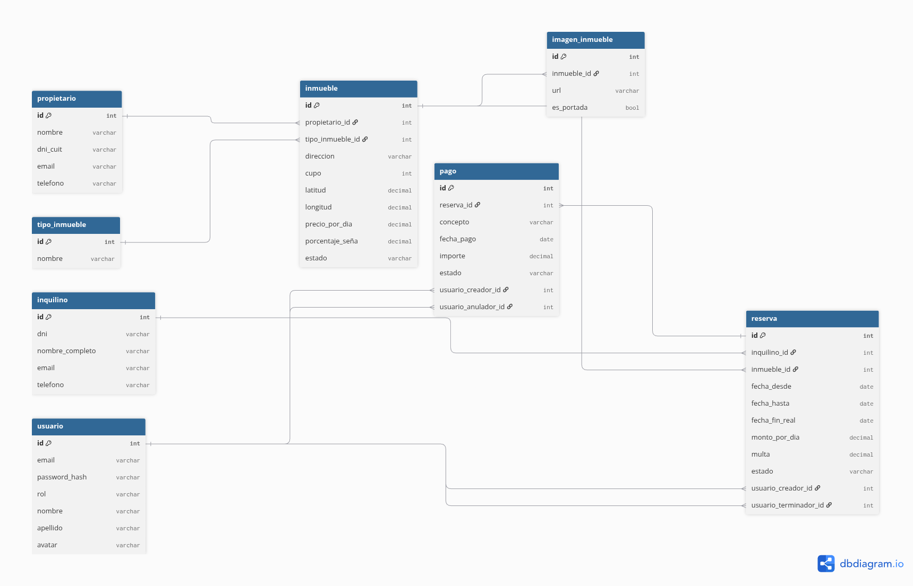

# Proyecto-Inmobiliaria-ULP

---

## Integrantes del grupo
* **Luis Ezequiel Sosa**
* **Iván Oscar Auriol López**
* **Florencia Magalí Castro**

---

## Instrucciones para ejecutar el proyecto
### 1. Clonar el repositorio
Abrí tu terminal y ejecutá los siguientes comandos:
```bash
git clone https://github.com/LuisSsos/Proyecto-Inmobiliaria-ULP
cd Proyecto-Inmobiliaria-ULP
```
También podés descargarlo comprimido, descomprimirlo y abrirlo carpeta en tu editor de confianza.

---

### 2.Levantá la db
Podés importar el archivo Inmobiliaria.sql en tu gestor de base de datos (por ejemplo phpMyAdmin con xampp) o copiar y pegar las líneas directamente del archivo y pegarlas en la caja de consultas de tu gestor para poder ejecutarlo.

---

### 3. Configurar conexión
Verificá que el archivo `appsettings.json` coincida con las credenciales de tu servidor MySQL. Por defecto está configurada así:
```json
{
  "ConnectionStrings": {
    "DefaultConnection": "server=localhost;port=3306;database=inmobiliaria;user=root;password=;"
  },
  "Logging": {
    "LogLevel": {
      "Default": "Information",
      "Microsoft.AspNetCore": "Warning"
    }
  },
  "AllowedHosts": "*"
}
```
Si usás DBeaver procurá poner el usuario y la contraseña de usuario en el appsettings.json o por el contrario, quitar la contraseña y cambiar  a usuario "root". Phpmyadmin suele venir por defecto con las configuraciones de user "root" y sin contraseña, pero si en algún momento lo has cambiado, tené en cuenta de modificarlo para poder correr este proyecto.

---

### 4. Ejecutar el proyecto
En una consola, sea del VS Code o gitbash, parate dentro del directorio del proyecto y ejecutá:
```bash
dotnet run
```

---

## 5. Algo muy importante la navegación (Rutas)

Al ejecutar el proyecto, la te va a indicar en qué URL y puerto se está alojando (por ejemplo, `http://localhost:5063`). Este puerto se define en el archivo `Properties/launchSettings.json` de cada entorno.

Actualmente, **el sistema no cuenta con una página de inicio con menú de navegación**. Para probar la aplicación, tenés que tipear directamente la ruta de los controladores en la barra de direcciones de tu navegador:

* **Módulo de Propietarios:** `http://localhost:5063/Propietario`
* **Módulo de Inquilinos:** `http://localhost:5063/Inquilino`

*(Fijate de reemplazar `5063` por el puerto que te indique la consola al ejecutar `dotnet run`)*.

Una vez dentro de cualquiera de esas dos pantallas  **podrás utilizar la interfaz gráfica normalmente** para acceder a los formularios de creación, edición y eliminación (Alta, Baja y Modificación) sin necesidad de escribir más rutas manualmente.

---

## Modelado

Se podrá ver el  diagrama relacional en la carpeta db.

### Esquema de Base de Datos



---

## ⚙️ Estado Actual del Desarrollo
* Configuración de la base de datos MySQL y la inyección de dependencias (`RepositorioBase`).
* Modelos, repositorios y controladores desarrollados para las entidades **Propietario** e **Inquilino**.
* Vistas Razor (CRUD) que permiten listar, crear, editar y eliminar registros desde la interfaz web.